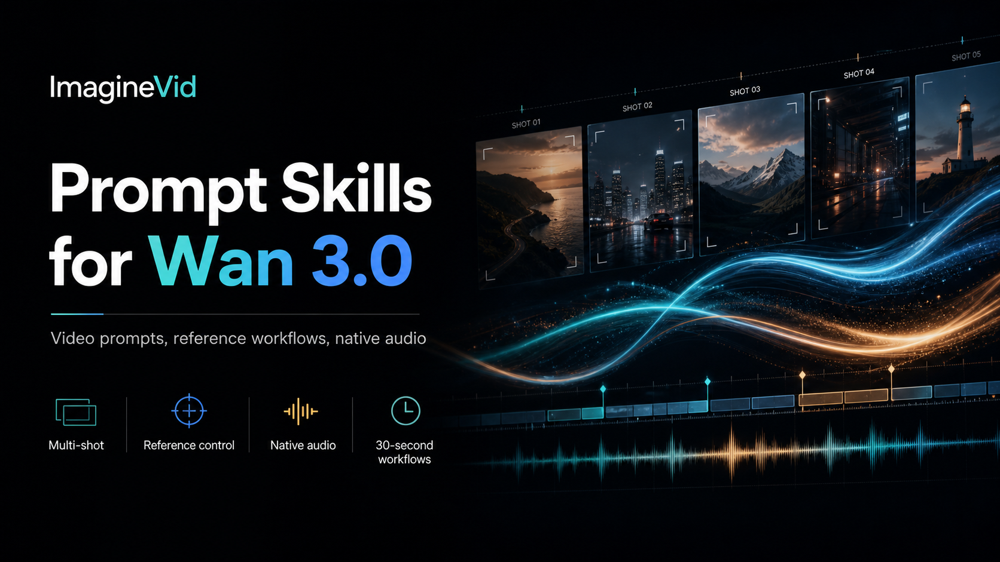

<a href="https://github.com/imagineVid/Awesome-wan-3-0-prompts-and-skills">
  
</a>

> Una biblioteca di brief per le inquadrature, schemi di movimento e workflow audiovisivi verificabili alla fonte per Wan 3.0 Video.
# Awesome Wan 3.0 Video: prompt e tecniche

[](https://github.com/sindresorhus/awesome)
[](https://github.com/imagineVid/Awesome-wan-3-0-prompts-and-skills)
[](https://creativecommons.org/licenses/by/4.0/)
[](https://github.com/imagineVid/Awesome-wan-3-0-prompts-and-skills/actions)
[](docs/CONTRIBUTING.md)

> Studia il brief, guarda il risultato, risali al creator e riutilizza la logica registica invece di copiare lo stile superficiale.

> **Attribuzioni e correzioni:** ogni caso pubblicato rimanda al creator e alla fonte canonica. I diritti restano ai rispettivi titolari. Apri una issue per modificare un'attribuzione o chiedere una rimozione.

---

[](README.md) [](README.es.md) [](README.pt.md) [](README.it.md) [](README.de.md) [](README.fr.md) [](README.ar.md) [](README.ja.md) [](README.ko.md) [](README.zh.md)
[](README.nl.md) [](README.ru.md) [](README.tr.md) [](README.pl.md)

---

## Crea con Wan 3.0 Video

**[Apri il workflow Wan 3.0 su ImagineVid](https://imaginevid.io/it/text-to-video)**

Usa questo repository per confrontare le istruzioni di un creator con il movimento risultante. Apri ImagineVid quando vuoi adattare la grammatica dell'inquadratura a una nuova clip.

La popolarità non è una prova. Un post poco visto con un prompt completo e un video utile può superare una vetrina virale priva di indicazioni riproducibili.

| Esigenza produttiva | Biblioteca delle prove | Workflow ImagineVid |
|---------|--------------|---------------------|
| Revisione del caso | Prompt, risultato e fonte | Genera e confronta |
| Esplorazione | Ricerca testuale nel repository | Esplorazione guidata dai workflow |
| Generazione | - | Apri Wan 3.0 |
| Lettura | Markdown nativo di GitHub | Workspace produttivo nel browser |
| Workflow video | - | Filtri produttivi |


### Esplora per workflow produttivo

- [**Percorsi della camera e ritmo delle inquadrature**](#workflow-camera-direction-shot-design) - Brief per le inquadrature costruiti su composizione, percorso della camera, blocking, ritmo, rivelazioni e transizioni.
- [**Audio nativo e performance**](#workflow-dialogue-performance-native-audio) - Prompt guidati dalla performance, in cui parlato, recitazione, atmosfera, musica o suono sincronizzato sostengono la scena.
- [**Movimento commerciale e presentazione**](#workflow-product-motion-commercial-spots) - Clip commerciali che mantengono prodotto, offerta, capo d'abbigliamento, piatto, dispositivo o momento di brand al centro del movimento.
- [**Continuità guidata dai riferimenti**](#workflow-image-to-video-subject-continuity) - Workflow ancorati a un'immagine che animano un fotogramma preservando identità, composizione, geometria del prodotto o layout dello storyboard.
- [**Azione stilizzata ed effetti**](#workflow-stylized-motion-visual-effects) - Schemi di effetti e animazione guidati da trasformazioni, simulazioni, fisica surreale, movimento grafico o un trattamento visivo distintivo.
- [**Confronto, restyling e controllo della scena**](#workflow-video-editing-restyling-scene-control) - Workflow su video esistenti che ne cambiano lo stile, li estendono, aggiungono, rimuovono, sostituiscono o reindirizzano una parte della scena proteggendo la continuità.

---

## Indice

- [Crea con Wan 3.0 Video](#crea-con-wan-30-video)
- [Che cos'è Wan 3.0 Video?](#che-cosè-wan-30-video)
- [Stato della raccolta](#stato-della-raccolta)
- [Prompt video in evidenza](#community-featured-prompts)
- [Prompt video della community](#community-prompt-cases)
- [Contribuisci con un caso verificato](#contribuisci-con-un-caso-verificato)
- [Licenza](#licenza)
- [Crediti dei creator](#crediti-dei-creator)
- [Crescita del repository](#crescita-del-repository)

---

## Che cos'è Wan 3.0 Video?

**Wan 3.0 Video** è documentato qui attraverso demo pubbliche collegate alle fonti e workflow della community. La raccolta distingue le prove osservabili dalle ricostruzioni editoriali: ogni caso conserva creator, post originale, risultato riproducibile e indicazione del modello; i prompt ricostruiti sono segnalati e non vengono presentati come trascrizioni letterali. Disponibilità e funzioni possono cambiare, quindi verifica l'accesso attuale prima dell'uso in produzione.

Per scrivere prompt utili, tratta ogni richiesta come un brief d'inquadratura, non come una moodboard. Indica azione visibile, comportamento della camera, ritmo, piano audio, riferimenti e ciò che deve restare stabile.

- **Parti dal testo o da un fotogramma** - Genera da una scena scritta oppure anima un'immagine che contiene già la composizione
- **Descrivi un movimento osservabile** - Indica blocking, slancio, interazione tra oggetti e conseguenza fisica di ogni azione
- **Scrivi i beat, non una sinossi** - Usa timecode o una breve sequenza di azioni quando contano ritmo e rivelazioni
- **Genera il suono insieme alla scena** - Includi dialoghi, atmosfera, musica o effetti quando l'audio fa parte della narrazione
- **Modifica un filmato esistente** - Cambia lo stile di una clip, modifica le condizioni della scena oppure aggiungi, rimuovi e sostituisci elementi visibili
- **Proteggi esplicitamente la continuità** - Indica quale volto, geometria del prodotto, layout, abbigliamento o sfondo non deve cambiare

**Riferimenti aggiornati:** [Wan 3.0 workflow on ImagineVid](https://imaginevid.io/it/text-to-video)

### Trasforma un prompt in un modello di inquadratura

I prompt video riutilizzabili separano le variabili della scena dalla logica registica. Sostituisci soggetto, ambientazione, battuta o prodotto mantenendo il percorso della camera, la struttura dei beat, il piano audio e le regole di continuità già verificati.

**Schema del modello:**
```
[DURATION + ASPECT RATIO]. [SUBJECT] esegue [VISIBLE ACTION] in [SETTING]. Camera: [FRAMING + MOVE]. Beat: [TIMED ACTIONS]. Audio: [DIALOGUE + FOLEY + AMBIENCE]. Preserva: [IDENTITY / PRODUCT / LAYOUT]. Evita: [FAILURE MODES].
```

Inizia con un'azione e un'idea per la camera. Aggiungi timing, audio e vincoli di preservazione solo quando risolvono un'esigenza produttiva visibile; poi cambia una sola variabile tra una generazione e l'altra.

---

## Stato della raccolta

<div align="center">

| Campo della raccolta | Valore corrente |
|--------|-------|
| Casi verificati | **7** |
| Selezione editoriale | **4** |
| Generato | **sabato 15 agosto 2026 alle ore 12:29:54 UTC** |

</div>

---

<a id="community-featured-prompts"></a>

## Prompt video in evidenza

> Selezionati per riproducibilità, chiarezza del movimento e utilità produttiva

<a id="prompt-1"></a>

### #1: Boxe in un'arena bagnata dalla pioggia con coreografia leggibile


#### Perché il workflow è importante

Un brief d'azione di 17 secondi che separa due combattenti, coreografa ogni scambio e usa pioggia, pozzanghere, camera e continuità per rendere chiaro il duello.

#### Prompt tradotto

```
Crea una sequenza di boxe cinematografica di 17 secondi, 16:9 e realismo 3D, con due combattenti adulte in un'arena circolare di pietra in rovina, di notte. Mantieni coerenti volti, corpi, abiti e posizioni. Usa solo pugni, parate, deviazioni, schivate e gioco di gambe. Inizia con un campo largo dal basso, passa a un tracking laterale durante lo scambio, aggiungi una breve schivata al rallentatore e chiudi con una mezza orbita controllata dopo un uppercut netto. Pioggia leggera, pozzanghere riflettenti, luna fredda, torce calde, sudore e gocce realistiche. Niente dialoghi, sottotitoli, musica, armi, poteri, errori anatomici, personaggi duplicati o watermark.
```

<details>
<summary>Prompt della fonte originale</summary>

```
Create a 17-second, 16:9 cinematic 3D-realism boxing sequence with two adult female fighters in a ruined circular stone arena at night. Keep their faces, bodies, outfits, and positions consistent. Use only fists, blocks, parries, slips, and footwork. Start with a low wide shot, move into lateral tracking during the exchange, add one brief slow-motion dodge, then finish on a controlled half-orbit after a clean uppercut. Light rain, reflective puddles, cold moonlight, warm torchlight, realistic sweat and water droplets. Keep the action readable and grounded. No dialogue, captions, music, weapons, powers, anatomy errors, duplicate characters, or watermark.
```

</details>

#### Video

<div align="center">
<a href="https://video.twimg.com/amplify_video/2084715180269654016/vid/avc1/1280x720/zbe-ld1fHtQVTO0d.mp4?tag=14"></a>

*Fai clic sull'anteprima per aprire il video* · **[▶ Guarda il video →](https://video.twimg.com/amplify_video/2084715180269654016/vid/avc1/1280x720/zbe-ld1fHtQVTO0d.mp4?tag=14)**
</div>

#### Elementi di prova

- **Autore:** [Oprèlia AI](https://x.com/OpreliaAI)
- **Fonte canonica:** [Fonte canonica](https://x.com/OpreliaAI/status/2084771796910211529)
- **Pubblicato:** 4 agosto 2026
- **Lingua del prompt:** en

**[Crea con queste indicazioni · ImagineVid](https://imaginevid.io/it/text-to-video)**

---

<a id="prompt-2"></a>

### #2: Duello con lancia in sette inquadrature e asse dello schermo bloccato


#### Perché il workflow è importante

Un prompt sorgente per un duello in animazione cel a sette inquadrature che fissa la geografia dello schermo, i vettori d'azione, i colori dell'energia, gli hit-stop e la continuità.

#### Prompt tradotto

```
Crea un combattimento di 15 secondi, 16:9, in animazione 2D disegnata a mano e divisa in sette inquadrature. Una combattente minuta con lancia parte a sinistra e un enorme picchiatore a destra; conserva questo asse di camera per tutto il clip. Usa energia ciano per lei e arancione incandescente per lui. Costruisci anticipazione, una lastra lanciata, un salto sui detriti, una scala di frammenti sospesi, un breve colpo al rallentatore, un primo piano degli occhi e un affondo finale con mezzo beat di silenzio e hit-stop. Mantieni design, volti, ferite, danni all'arena, fisica pesante ed esattamente sette inquadrature. Niente inquadrature extra, testo, sottotitoli, watermark o corpi fusi.
```

<details>
<summary>Prompt della fonte originale</summary>

```
Create a 15-second, 16:9 seven-shot 2D hand-drawn cel-animated fight. A small spear fighter starts screen-left and a massive brawler starts screen-right; keep that south-side camera axis throughout. Use cyan energy for the spear fighter and ember-orange energy for the brawler. Build the sequence with anticipation, a thrown stone slab, a rubble vault, a rising staircase of airborne chunks, a brief slow-motion backhand, an eye close-up, and a final spear pierce with a half-beat of silence and a hit-stop. Preserve character designs, face details, injury continuity, arena damage, heavy rubble physics, and the seven-shot count. No extra shots, text, subtitles, watermark, or fused bodies.
```

</details>

<details>
<summary>Related prompt variants (1)</summary>

**Creator source prompt (English)**

```
Prompt:
Multi-shot (7 shots).
TSUBAME (Spear Girl) — 17, lean and small, sharp jawline, short black bob with long straight bangs, fierce dark-teal eyes; sleeveless white gi top with teal trim, black shorts, bandaged forearms and shins, split-toe boots; carries a two-meter spear with a slim leaf-blade head — the spearhead and her motion trails read cyan.
GARAN (Brawler) — huge, over two meters, slab-muscled, shaved head, heavy brow, small pale eyes; bare-chested with a cracked stone-grey harness strap, massive taped fists, canvas trousers, iron-shod boots. Every slab he rips from the floor glows ember-orange in its tear-lines, and orange dust light clings to his hands.

Style: 2D hand-drawn cel animation, film-grade sakuga action. Clear line art, flat cel shading with hard shadow boundaries; non-photoreal — no pore-level skin, no 3D volumetric render feel. Fighter colors LOCKED: Tsubame = cyan (spear-tip glint, afterimage trails, speed-lines), Garan = ember-orange (molten glow in every floor tear, rubble rim-light). All glows two-tone — white-hot core, saturated colored rim, trailing dust and embers that linger after each impact. World: desaturated slate-grey shattered arena with a huge faded mosaic emblem in the floor, so both hues detonate off it. The nearest glow is the key light — cyan rim on her, orange bounce on him and the rock. Bold corner-to-corner diagonals on action; fast beats drawn as key poses, smear frames, and impact frames — never continuous legible travel. Real mass everywhere: slabs are tons, not props. Camera: animation camerawork — snap-zooms, speed-lines, orbits, held frames, hit-stops all allowed.

⚠️This video has STRICTLY 7 shots — do not add extra shots.
⚠️SPATIAL LAYOUT (MAIN VIEW = from the SOUTH side, top-down axis west–east; screen-left = west, screen-right = east): Tsubame starts at the west edge facing east (screen-right, toward Garan); Garan stands ~18m east of her, facing west (screen-left, toward her). Her vault path travels west→east, rising diagonally toward the upper frame as she climbs the airborne chunks. 180° LINE: camera stays on the south side all clip — Tsubame on screen-left, Garan on screen-right, no swapping.
⚠️ACTION VECTORS: (V1, SHOT 2) Garan hurls a car-sized slab two-handed, east→west (screen right→left), at Tsubame's center mass — she slides flat under it; it detonates on the floor west of her. (V2, SHOT 3) Garan's right-arm sweep flings a fan of rubble east→west — she runs into it and vaults the chunks. (V4, SHOT 5) Garan's right backhand sweeps east→west at her head as she reaches the fourth chunk — she plants the spear in the chunk and corkscrews around the shaft past the fist; one shard grazes her LEFT cheek. (V5, SHOT 7) Tsubame's spear thrust travels west→east (screen left→right) through the center of his final slab into Garan's crossed-forearm guard at chest height — he is driven east, heels carving trenches.
⚠️Continuity across cuts: designs, colors, and arena damage stay identical and only progress, never reset — the left-cheek cut appears in SHOT 5 and persists bleeding a thin line through SHOTS 6–7; rubble and craters only accumulate.

[SHOT 1] · Anticipation (~2s): scale-wide, static with a slow drift — two tiny figures on the vast cracked mosaic. Garan RIPS a car-sized slab out of the floor, orange light flaring in the tear-lines, and shoulders it; across the arena Tsubame drops low, spear leveled flat, one toe carving the dust. Her breathing is even; his grin is wide.
[SHOT 2] · The slab (~2s): low lateral tracking with her — the slab comes in huge, right→left; she slides flat under its shadow, back scraping sparks, and it detonates behind her in a wall of grey dust with an orange core. She's up and sprinting before the debris lands.
[SHOT 3] · The scatter (~2.5s): Garan tears the floor again and sweeps his arm — a shotgun fan of rubble fills the air right→left. She doesn't brake; she accelerates INTO it, first vault off the lowest chunk, drawn as anticipation pose → smear → landing pose. Lunge-track, background streaking.
[SHOT 4] · The staircase (~2.5s, the money shot): low hero-angle orbit rising with her — Tsubame vaults chunk to airborne chunk up the diagonal, each foot-plant cracking the stone she leaves, cyan afterimage stitching one unbroken line through his barrage. Below and ahead, Garan's eyes narrow — he's reading it.
[SHOT 5] · The backhand (~1.5s, brief slow-mo): his colossal backhand fills the frame right→left — she plants the spear in the fourth chunk and corkscrews around the shaft, the fist parting her hair, a shard opening a thin cut on her left cheek. Blood beads. Snap back to full speed as her feet find the chunk's edge.
[SHOT 6] · The gate (~1s): held extreme close-up, slow push-in — her eyes only, no blink, cyan spearhead light reflected across them, the cheek-cut's red line sharp against the cel shading. Behind her focus, blurred, Garan heaves the biggest slab of the fight overhead, orange light pouring through its cracks.
[SHOT 7] · The pierce (~3.5s): he hurls the colossal slab — she dives spear-first off the top chunk, left→right, and PIERCES STRAIGHT THROUGH ITS CENTER: the slab splits into two halves that peel past the camera. All sound — music and SFX — drops dead silent for the half-beat of the pierce; one deep concussive boom resolves it as the spear-tip slams into his crossed-forearm guard. Hit-stop on the impact frame, FX touching all four edges, near-white color-out. Then motion resumes: Garan is driven backward, iron heels carving twin trenches, the floor cratering — and holds his feet. Camera whips with her dive, freezes on the hit-stop, then eases back to a wide: both standing, dust ring expanding, the exchange over but the fight not.

Environmental activity: no bystanders — an empty ruined arena; dust motes and small debris rain steadily after every impact; distant rumble of settling stone.
Audio: music allowed and scored to the fight; full SFX — stone shear, rubble whistle, the silence-drop and single boom on the pierce.

The two fighters remain two distinct, separate bodies in every frame, even at full contact. Faces, hands, and designs stay on-model start to finish — five-fingered hands with clean articulation, correct limb topology, character designs identical shot to shot. The spear keeps its slim leaf-blade shape and full two-meter length in every frame. Rubble flies on heavy ballistic arcs with real tonnage — each chunk accelerates, hits hard, and stays down; her foot-plants grip and crack the stone they leave (the SHOT 5 slow-mo and SHOT 7 hit-stop are deliberate, intentional holds). Full fluid high-frame-feel animation with a living camera throughout; matte hand-drawn cel surfaces; color stays disciplined to the locked cyan/orange/slate palette. No watermark, no on-screen text, no subtitles.
15 seconds. 16:9.
```

Source: [Source](https://x.com/Dani__oros/status/2084475003223896189)

</details>

#### Video

<div align="center">
<a href="https://video.twimg.com/amplify_video/2084474303987474432/vid/avc1/1920x1080/xdN7PiMNI73-LFHG.mp4?tag=29"></a>

*Fai clic sull'anteprima per aprire il video* · **[▶ Guarda il video →](https://video.twimg.com/amplify_video/2084474303987474432/vid/avc1/1920x1080/xdN7PiMNI73-LFHG.mp4?tag=29)**
</div>

#### Elementi di prova

- **Autore:** [Dani Oros](https://x.com/Dani__oros)
- **Fonte canonica:** [Fonte canonica](https://x.com/Dani__oros/status/2084475003223896189)
- **Pubblicato:** 4 agosto 2026
- **Lingua del prompt:** en

**[Crea con queste indicazioni · ImagineVid](https://imaginevid.io/it/text-to-video)**

---

<a id="prompt-3"></a>

### #3: Apertura da drama televisivo con un'unica rivelazione visiva


#### Perché il workflow è importante

Ricostruzione trasparente della logica di ripresa di una demo di apertura televisiva Wan 3.0: stabilire il luogo, rivelare un personaggio e chiudere su un beat motivato.

#### Prompt tradotto

```
Crea un'apertura da drama televisivo di 30 secondi, 16:9, in un unico mondo visivo coerente. Inizia con un campo largo tranquillo all'alba e avanza verso un personaggio che attraversa una strada urbana bagnata. Taglia solo quando cambia il beat narrativo: un riflesso rivela una seconda figura, la camera segue il protagonista sotto una tettoia e un lento push-in termina quando nota un oggetto nella mano. Mantieni abiti, meteo, architettura e direzione dello sguardo. Usa colori naturali sobri, passi, pioggia sul metallo, traffico lontano e un basso crescendo musicale sulla rivelazione finale. Niente sottotitoli, loghi o reset arbitrari della scena.
```

<details>
<summary>Prompt della fonte originale</summary>

```
Create a 30-second, 16:9 television-drama opening in one coherent visual world. Begin with a quiet wide establishing shot at dawn, then track toward a lone character moving through a rain-wet urban street. Cut only when the story beat changes: a reflection reveals a second figure, the camera follows the protagonist under an awning, and a slow push-in lands on the character noticing an object in their hand. Preserve wardrobe, weather, architecture, and screen direction across the sequence. Use restrained natural color, dialogue-free ambience, footsteps, distant traffic, rain on metal, and one low musical swell at the final reveal. Keep the camera purposeful and the acting subtle; no captions, logos, or arbitrary scene resets.
```

</details>

#### Video

<div align="center">
<a href="https://video.twimg.com/amplify_video/2084964593970118656/vid/avc1/1920x1080/O-G6eb25Vmm-HSLT.mp4?tag=29"></a>

*Fai clic sull'anteprima per aprire il video* · **[▶ Guarda il video →](https://video.twimg.com/amplify_video/2084964593970118656/vid/avc1/1920x1080/O-G6eb25Vmm-HSLT.mp4?tag=29)**
</div>

#### Elementi di prova

- **Autore:** [WaveSpeed AI](https://x.com/wavespeed_ai)
- **Fonte canonica:** [Fonte canonica](https://x.com/wavespeed_ai/status/2084965430687588477)
- **Pubblicato:** 5 agosto 2026
- **Lingua del prompt:** en

**[Crea con queste indicazioni · ImagineVid](https://imaginevid.io/it/text-to-video)**

---

<a id="prompt-4"></a>

### #4: Personaggio, luogo e voce assemblati da riferimenti separati


#### Perché il workflow è importante

Un brief multimodale riutilizzabile derivato dalla nota di capacità di PixelDojo: assegna identità, ambiente e voce a input distinti e dichiara le regole di continuità.

#### Prompt tradotto

```
Crea una scena cinematografica di 20 secondi, 16:9, usando tre riferimenti: l'immagine 1 fornisce l'identità del personaggio, l'immagine 2 il luogo e l'audio 1 la voce. Fai camminare il personaggio dal primo piano verso l'ambiente di riferimento, poi girare verso la camera e pronunciare una frase breve e naturale con la voce di riferimento. Mantieni volto, capelli, abiti, scala, rapporto spaziale e identità vocale per tutto il clip. Usa un lento movimento laterale che diventa un push-in morbido durante la battuta. Abbina luce e prospettiva, aggiungi ambiente e passi. Niente deriva dell'identità, persone extra, testo o watermark.
```

<details>
<summary>Prompt della fonte originale</summary>

```
Create a 20-second, 16:9 cinematic scene from three references: image 1 supplies the character identity, image 2 supplies the location, and audio 1 supplies the speaking voice. Let the character walk from the foreground into the referenced location, turn toward camera, and deliver one short natural line from the audio reference. Preserve the character's face, hair, clothing, scale, spatial relationship to the environment, and vocal identity from start to finish. Use a slow lateral camera move that becomes a gentle push-in at the line. Match the lighting and perspective of the references, add quiet room tone and footsteps, and keep the performance restrained. No identity drift, extra people, text, or watermark.
```

</details>

#### Video

<div align="center">
<a href="https://video.twimg.com/amplify_video/2083212925255446528/vid/avc1/1280x720/QK8mfQ6SmZT9g0RO.mp4?tag=29"></a>

*Fai clic sull'anteprima per aprire il video* · **[▶ Guarda il video →](https://video.twimg.com/amplify_video/2083212925255446528/vid/avc1/1280x720/QK8mfQ6SmZT9g0RO.mp4?tag=29)**
</div>

#### Elementi di prova

- **Autore:** [PixelDojo](https://x.com/PixelDojoAI)
- **Fonte canonica:** [Fonte canonica](https://x.com/PixelDojoAI/status/2083212955072807175)
- **Pubblicato:** 31 luglio 2026
- **Lingua del prompt:** en

**[Crea con queste indicazioni · ImagineVid](https://imaginevid.io/it/text-to-video)**

---

<a id="community-prompt-cases"></a>

## Prompt video della community

> Ordinati per data della fonte e valore editoriale.

<a id="workflow-camera-direction-shot-design"></a>

### Percorsi della camera e ritmo delle inquadrature (3)

Brief per le inquadrature costruiti su composizione, percorso della camera, blocking, ritmo, rivelazioni e transizioni.

**Prompt video in evidenza**

- [Boxe in un'arena bagnata dalla pioggia con coreografia leggibile](#prompt-1)
- [Apertura da drama televisivo con un'unica rivelazione visiva](#prompt-3)

<a id="prompt-5"></a>

#### #1: Test narrativo verticale con logica di camera intenzionale


##### Perché il workflow è importante

Ricostruzione basata su un confronto verticale con lo stesso prompt: un personaggio, un'escalation chiara e una camera al servizio della storia.

##### Prompt tradotto

```
Crea un test narrativo verticale di 15 secondi, 9:16. Inizia su un piano medio di un corriere sotto un'insegna intermittente di notte. Da 0 a 4 secondi mantieni la tensione con un lento push-in e traffico lontano. Da 4 a 8 una seconda figura attraversa lo sfondo; fai un pan appena sufficiente a rivelare la reazione del corriere. Da 8 a 12 arretra mentre corre in un passaggio stretto, preservando giacca rossa e pavimento bagnato. Da 12 a 15 sali in una compatta vista dall'alto dell'uscita e dell'alba. Mantieni direzione, identità, luce e geografia. Usa passi, tessuto, pioggia e un impulso musicale discreto. Niente tagli casuali, testo o watermark.
```

<details>
<summary>Prompt della fonte originale</summary>

```
Create a 15-second, 9:16 vertical narrative test. Start on a medium shot of a courier waiting beneath a flickering street sign at night. At 0-4 seconds, hold the tension with a slow push-in and distant traffic. At 4-8 seconds, a second figure crosses the background; pan just enough to reveal the courier's reaction. At 8-12 seconds, track backward as the courier runs through a narrow passage, preserving the red jacket and wet pavement. At 12-15 seconds, rise into a compact overhead reveal of the exit and the approaching dawn. Keep screen direction, body identity, lighting, and geography stable. Use footsteps, fabric movement, rain, and one restrained musical pulse. No random cuts, text, captions, or watermark.
```

</details>

##### Video

<div align="center">
<a href="https://video.twimg.com/amplify_video/2085020209925210112/vid/avc1/1920x3238/ltuegtJLzV0abXY_.mp4?tag=29"></a>

*Fai clic sull'anteprima per aprire il video* · **[▶ Guarda il video →](https://video.twimg.com/amplify_video/2085020209925210112/vid/avc1/1920x3238/ltuegtJLzV0abXY_.mp4?tag=29)**
</div>

##### Elementi di prova

- **Autore:** [WaveSpeed AI](https://x.com/wavespeed_ai)
- **Fonte canonica:** [Fonte canonica](https://x.com/wavespeed_ai/status/2085025284378538045)
- **Pubblicato:** 5 agosto 2026
- **Lingua del prompt:** en

**[Crea con queste indicazioni · ImagineVid](https://imaginevid.io/it/text-to-video)**

---

<a id="workflow-dialogue-performance-native-audio"></a>

### Audio nativo e performance (2)

Prompt guidati dalla performance, in cui parlato, recitazione, atmosfera, musica o suono sincronizzato sostengono la scena.

<a id="prompt-6"></a>

#### #2: Scena in accesso anticipato con audio nativo e cue temporizzati


##### Perché il workflow è importante

Ricostruzione basata su un post di accesso anticipato che cita testo-video, immagine-video, 1080p, 30 secondi e suono nativo, trattando l'audio come parte del brief.

##### Prompt tradotto

```
Crea una scena cinematografica di 30 secondi, 16:9, dall'immagine di un ciclista fermo su una strada costiera vuota. Mantieni ciclista, geometria della bici, orizzonte e ora del giorno. Inizia con vento naturale e mare lontano mentre la camera esegue un lento dolly laterale. A 8 secondi il ciclista parte; ruote, giacca e spruzzi devono reagire con peso credibile. A 18 secondi passa a un tracking basso mentre il sole attraversa le nuvole. Genera audio nativo di gomme, catena, vento, gabbiani e un morbido sollevamento musicale all'orizzonte. Niente sottotitoli, loghi, deriva del volto o loop artificiale.
```

<details>
<summary>Prompt della fonte originale</summary>

```
Create a 30-second, 16:9 cinematic image-to-video scene from the attached still of a cyclist waiting at an empty coastal road. Preserve the cyclist, bicycle geometry, horizon, and time of day. Begin with natural wind and distant surf as the camera makes a slow side dolly. At 8 seconds, the cyclist starts forward; the wheels, loose jacket fabric, and road spray respond with believable weight. At 18 seconds, the camera moves into a low tracking angle while the sun breaks through the cloud. Build native audio from tire hum, chain movement, wind, gulls, and one soft musical lift at the horizon reveal. Keep motion coherent for the full shot, with no captions, logos, face drift, or artificial loop.
```

</details>

##### Video

<div align="center">
<a href="https://video.twimg.com/amplify_video/2085089914044207104/vid/avc1/1920x1080/YSnIMXNgd_j1-1_q.mp4?tag=29"></a>

*Fai clic sull'anteprima per aprire il video* · **[▶ Guarda il video →](https://video.twimg.com/amplify_video/2085089914044207104/vid/avc1/1920x1080/YSnIMXNgd_j1-1_q.mp4?tag=29)**
</div>

##### Elementi di prova

- **Autore:** [Enhance AI](https://x.com/enhance_ai)
- **Fonte canonica:** [Fonte canonica](https://x.com/enhance_ai/status/2085089954099757225)
- **Pubblicato:** 5 agosto 2026
- **Lingua del prompt:** en

**[Crea con queste indicazioni · ImagineVid](https://imaginevid.io/it/text-to-video)**

---

<a id="prompt-7"></a>

#### #3: Rivelazione d'ambiente in stile demo ufficiale con suono nativo


##### Perché il workflow è importante

Ricostruzione dichiarata a partire da un post della community che identifica il video come demo ufficiale di Wan 3.0, senza trasformare specifiche non verificate in fatti.

##### Prompt tradotto

```
Crea una rivelazione cinematografica d'ambiente di 30 secondi, 16:9. Inizia in un interno silenzioso con una persona che apre una finestra alta al crepuscolo. Segui il gesto con un lento push-in a mano e passa all'esterno, verso un ampio paesaggio costiero con nuvole, luci lontane e vento visibile in un tessuto vicino. Mantieni persona e architettura coerenti mentre il mondo si apre. Usa ambiente interno, vento, uccelli, onde e una contenuta salita orchestrale. Lascia respirare il campo largo finale. Dai priorità a continuità spaziale, luce fisica e percorso di camera leggibile. Niente testo, sottotitoli, loghi o etichette tecniche inventate.
```

<details>
<summary>Prompt della fonte originale</summary>

```
Create a 30-second, 16:9 cinematic environment reveal. Start in a quiet interior with a person opening a tall window at blue hour. Follow the movement with a slow handheld push toward the opening, then transition outside into a wide coastal landscape with moving clouds, distant lights, and visible wind through nearby fabric. Keep the person and the architecture consistent while the world expands around them. Use natural room tone that gives way to wind, birds, soft surf, and a restrained orchestral rise. Let the final wide shot breathe for several seconds. Prioritize spatial continuity, physical light, and a readable camera path. No text, subtitles, logos, or invented technical labels.
```

</details>

##### Video

<div align="center">
<a href="https://video.twimg.com/amplify_video/2084741113894584320/vid/avc1/1280x720/VKBqU5of84zaTd6F.mp4?tag=29"></a>

*Fai clic sull'anteprima per aprire il video* · **[▶ Guarda il video →](https://video.twimg.com/amplify_video/2084741113894584320/vid/avc1/1280x720/VKBqU5of84zaTd6F.mp4?tag=29)**
</div>

##### Elementi di prova

- **Autore:** [Furkan Gozukara](https://x.com/FurkanGozukara)
- **Fonte canonica:** [Fonte canonica](https://x.com/FurkanGozukara/status/2084741391012286807)
- **Pubblicato:** 4 agosto 2026
- **Lingua del prompt:** en

**[Crea con queste indicazioni · ImagineVid](https://imaginevid.io/it/text-to-video)**

---

<a id="workflow-image-to-video-subject-continuity"></a>

### Continuità guidata dai riferimenti (1)

Workflow ancorati a un'immagine che animano un fotogramma preservando identità, composizione, geometria del prodotto o layout dello storyboard.

**Prompt video in evidenza**

- [Personaggio, luogo e voce assemblati da riferimenti separati](#prompt-4)

<a id="workflow-stylized-motion-visual-effects"></a>

### Azione stilizzata ed effetti (1)

Schemi di effetti e animazione guidati da trasformazioni, simulazioni, fisica surreale, movimento grafico o un trattamento visivo distintivo.

**Prompt video in evidenza**

- [Duello con lancia in sette inquadrature e asse dello schermo bloccato](#prompt-2)

## Contribuisci con un caso verificato

Hai trovato un caso di Wan 3.0 Video che insegna una vera tecnica registica? Invia il prompt, il risultato riproducibile, il creator, la fonte, le prove del modello e la modalità di input tramite GitHub Issues.

### Issue GitHub

1. [**Invia un prompt video**](https://github.com/imagineVid/Awesome-wan-3-0-prompts-and-skills/issues/new?template=submit-prompt.yml)
2. Fornisci il brief completo, la fonte, il creator, le prove del modello e il media riproducibile
3. Un maintainer verifica provenienza, valore del video, ambito e duplicati
4. I casi approvati vengono normalizzati nella fonte dati locale
5. Il generatore pubblica il caso dopo il superamento di tutti i controlli di qualità

**Regola editoriale:** La popolarità non è una prova. Un post poco visto con un prompt completo e un video utile può superare una vetrina virale priva di indicazioni riproducibili.

Leggi [CONTRIBUTING.md](docs/CONTRIBUTING.md) prima di inviare un contributo.

---

## Licenza

I testi editoriali e il codice realizzati da ImagineVid sono distribuiti con licenza [CC BY 4.0](https://creativecommons.org/licenses/by/4.0/). Prompt di terze parti, identità dei creator, marchi, immagini e video restano ai rispettivi titolari e sono esclusi da questa licenza.

---

## Crediti dei creator

<details>
<summary>Community creators we thank (6)</summary>

[Dani Oros](https://x.com/Dani__oros) · [Enhance AI](https://x.com/enhance_ai) · [Furkan Gozukara](https://x.com/FurkanGozukara) · [Oprèlia AI](https://x.com/OpreliaAI) · [PixelDojo](https://x.com/PixelDojoAI) · [WaveSpeed AI](https://x.com/wavespeed_ai)

</details>

---

## Crescita del repository

[](https://github.com/imagineVid/Awesome-wan-3-0-prompts-and-skills/stargazers)

**[Crescita del repository](https://star-history.com/#imagineVid/Awesome-wan-3-0-prompts-and-skills&Date)**

---

<div align="center">

**[Crea con Wan 3.0 Video](https://imaginevid.io/it/text-to-video)** •
**[Invia un caso verificato](https://github.com/imagineVid/Awesome-wan-3-0-prompts-and-skills/issues/new?template=submit-prompt.yml)** •
**[Metti una stella alla raccolta](https://github.com/imagineVid/Awesome-wan-3-0-prompts-and-skills)**

<sub>Generato dai dati locali versionati il 2026-08-15T12:29:54.489Z</sub>

</div>
